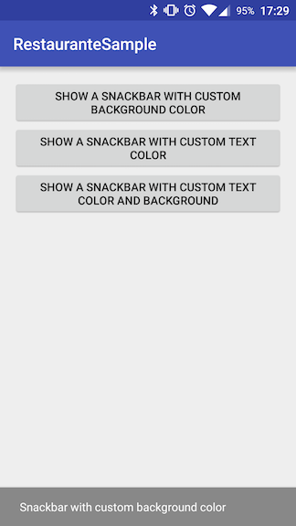
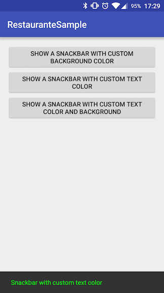
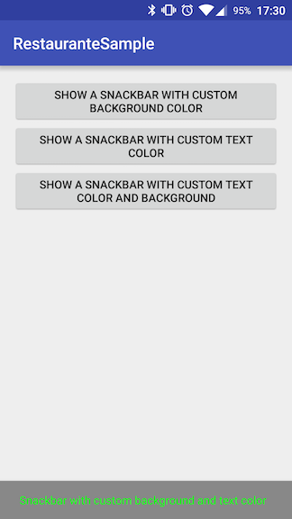

# Restaurant
An extension to the Snackbar view avaiable at the Android Design Support Library.

Restaurant wraps the `Snackbar` implementation to easily allow more customization. With Restaurant you can change the text and background color of the `Snackbar` just calling a method. Restaurant can also detect the correct view to atach the Snackbar just receiving the activity. 

# Gradle Dependency

[](https://jitpack.io/#SandroMachado/Restaurant)

### Repository

First, add the following to your app's `build.gradle` file:

```Gradle
repositories {
    maven { url "https://jitpack.io" }
}
```

Them include the Restaurant dependency:

```gradle
dependencies {

    // ... other dependencies here.
    // Set the transitive = false if you already have the Design Support Library dependency.
    compile('com.github.SandroMachado.restaurant:0.1.0@aar') {
        transitive = true
    }
}
```

# Usage

Show a Snackbar with a custom background color:



```Java
new Restaurant(MainActivity.this, "Snackbar with custom background color", Snackbar.LENGTH_LONG)
    .setBackgroundColor(Color.GRAY)
    .show();
```

Show a Snackbar with a custom text color:



```Java
new Restaurant(MainActivity.this, "Snackbar with custom text color", Snackbar.LENGTH_LONG)
    .setTextColor(Color.GREEN)
    .show();
```

Show a custom Snackbar:



```Java
new Restaurant(MainActivity.this, "Snackbar with custom background and text color", Snackbar.LENGTH_LONG)
    .setBackgroundColor(Color.GRAY)
    .setTextColor(Color.GREEN)
    .show();
```